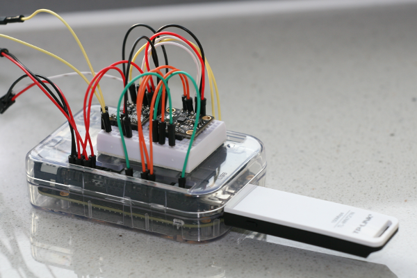
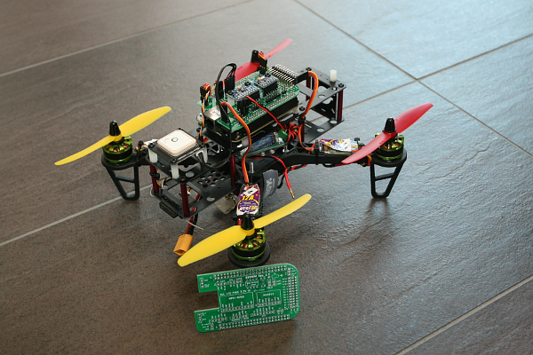

# BBBmini

Linux ArduPilot DIY Cape for the BeagleBone Black / Green  (BBB / BBG)

BBBmini flight video

# Why?
* Have fun to build your own BeagleBone ArduPilot Cape
* Easy start to ArduPilot Linux development
* No SMD soldering required
* DIY friendly connector

# About BBBmini
BBBmini is an autopilot / flightcontroller Cape for the BeagleBone. BBBmini + BeagleBone can be used as a state of the art Linux autopilot / flightcontroller for Copter, Planes or Rovers. BBBmini can be used with ArduPilot (open source unmanned aerial vehicle flight stack. BBBmini is a DIY project using widely available IMU and barometer breakout sensor boards, there is no SMD soldering necessary. The design is made that everybody can build a BBBmini by himself. In flight internet connection is done via WiFi link.

What does BBBmini offer:

* DIY state of the art UAV autopilot / flightcontroller
* Easy to build, no SMD soldering necessary
* Free hardware, free software
* Autopilot / flightcontroller software is running on Real-Time Linux
* DIY friendly connectors 0.1” pin header
* 12 x PWM out with individual frequency for each channel
* RC in connector for PPM, S.BUS or spektrum satellite input
* MPU-9250 IMU 9 x DOF
* MS5611 barometer
* HC-SR04 ultrasonic rangefinder
* GPS for full autonomous flights
* Voltage and current sensing
* I2C / GROVE connector for Status display and additional sensors
* SPI connector for second redundant IMU
* UART / GROVE connector for GPS
* UART / GROVE connector for telemetry
* CAN connector with on board CAN bus transceiver
* USB connector used for WiFi, Laser rangefinder or cameras
* Excellent cost-performance ratio

The BBBmini project development includes:
* BBBmini documentation / how to
* BBBmini PCB design done with Kicad all sources free available on Github
* Device tree file for BBBmini hardware
* PRU firmware: 12 x PWM OUT with better than 1us accuracy, separate frequency for each channel. RC input capture with 5ns accuracy, can be used to capture PPM, S.BUS or spektrum satellite
* PRU firmware: HC-SR04 Ultrasonic Rangefinder device driver
* Commits to ArduPilot project to get BBBmini supported by ArduPilot
* Development of status display device driver for ArduPilot
* Add redundancy sensors via SPI / I2C or UART
* Lots of test flights and fine tuning in hardware and software to get a stable and reliable BeagleBone Green flightcontroller

#Why BeagleBone

Once I had the idea to develop an flightcontroller, I have examined on the market available computer for their suitability. The following criteria should be met by the computer being used.

First, the computer should be very well supported by the community. As a result, a Raspberry Pi or BeagleBone could be used. In addition, the flightcontroller should be set up with as little as possible external components.

The decision was made for the BeagleBone. With the Programmable Real-Time Units of the BeagleBone, it is possible to create the BBBmini with only a few sensor breakout boards. In addition the BeagleBone offers many interfaces such as UART, SPI, I2C, CAN, USB and ADC. All these interfaces are used by the BBBmini.

##BeagleBone parts used for BBBmini

* Main CPU running Linux
* PRU0 device driver for HC-SR04 ultrasonic rangefinder
* PRU1 to generate 12 PWM signals and receive PPM, S.BUS or spektrum satellite input
* Grove / I2C for communication to the status display, external compass or Laser rangefinder
* GROVE / serial 2 for sensors like Laser Rangefinder
* Serial 4 for telemetry radio
* Serial 5 for GPS
* ADC for voltage and current sensing
* SPI1 for high speed data transfer from IMU and Baro sensor
* SPI0 for high speed data transfer from second redundant IMU or other hardware
* CAN for communication with ESCs and additional hardware
* USB for WiFi and camera connection for life HD video transmission
* Ethernet for communication on ground

# [Hardware](doc/hardware/hardware.md)
* BeagleBone Black or BeagleBone Green
* [BBBMINI-PCB](https://github.com/mirkix/BBBMINI-PCB) (recommended) or BeagleBone Proto Cape with IMU MPU-9250 breakout board and Baro MS5611 breakout board (try to get a GY-9250 and GY-63 breakout board)
* RC receiver (S.BUS, PPM-Sum, Spektrum Satellit SPM 9645)
* optional GPS receiver
* optional HC-SR04 Ultrasonic Module

Click [here](doc/hardware/hardware.md) for further instruction how to assemble the board and the pin assignment.

# [Software](doc/software/software.md)
For instructions how to get, build, test and run the software click [here](doc/software/software.md).

# Support

## Support Chat

## User Group

[DIY DRONES BBBMINI User Group](http://diydrones.com/group/bbbmini)

# License

 BBBmini by <a xmlns:cc="http://creativecommons.org/ns#" href="https://github.com/mirkix" property="cc:attributionName" rel="cc:attributionURL">Mirko Denecke</a> is licensed under a <a rel="license" href="http://creativecommons.org/licenses/by-sa/4.0/">Creative Commons Attribution-ShareAlike 4.0 International License</a>.

UNLESS OTHERWISE MUTUALLY AGREED TO BY THE PARTIES IN WRITING, LICENSOR OFFERS THE WORK AS-IS AND MAKES NO REPRESENTATIONS OR WARRANTIES OF ANY KIND CONCERNING THE WORK, EXPRESS, IMPLIED, STATUTORY OR OTHERWISE, INCLUDING, WITHOUT LIMITATION, WARRANTIES OF TITLE, MERCHANTABILITY, FITNESS FOR A PARTICULAR PURPOSE, NONINFRINGEMENT, OR THE ABSENCE OF LATENT OR OTHER DEFECTS, ACCURACY, OR THE PRESENCE OF ABSENCE OF ERRORS, WHETHER OR NOT DISCOVERABLE. SOME JURISDICTIONS DO NOT ALLOW THE EXCLUSION OF IMPLIED WARRANTIES, SO SUCH EXCLUSION MAY NOT APPLY TO YOU. EXCEPT TO THE EXTENT REQUIRED BY APPLICABLE LAW, IN NO EVENT WILL LICENSOR BE LIABLE TO YOU ON ANY LEGAL THEORY FOR ANY SPECIAL, INCIDENTAL, CONSEQUENTIAL, PUNITIVE OR EXEMPLARY DAMAGES ARISING OUT OF THIS LICENSE OR THE USE OF THE WORK, EVEN IF LICENSOR HAS BEEN ADVISED OF THE POSSIBILITY OF SUCH DAMAGES.
